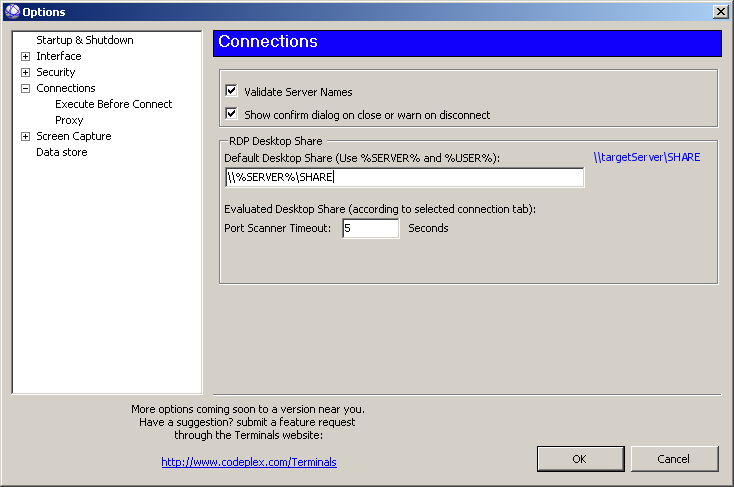
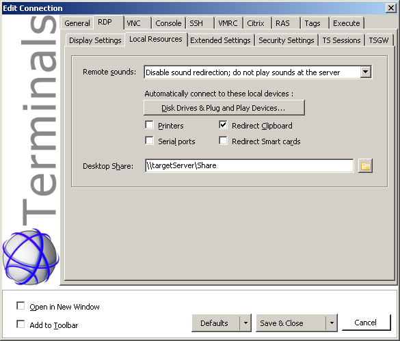

# Configure connection share
Terminals allow you to send files to target session using drag and drop into the session window. Notice, that it is available only for RDP connections. To enable this feature you have to:

# Setup share on the target machine with write permissions for you
# configure the Terminals to use this feature when connecting

## Default share path
To configure one shared path for all favorites you use, you don't have to do it for all of them. Instead, go to Tools > Options. In application options dialog navigate to the Connections group.
Here you can find text box, where you write absolute network (UNC) path to the share on the target machine. If the path is valid for current active session, a blue text with evaluated path will be shown close to the box. Because the target server path differs between your favorites, you can use two variables:

* **%SERVER%** : Evaluates as favorite "Computer" property value (usually the IP address or server host name)
* **%USER%** : Evaluates as favorite "User name" used to log-in to the server.

NOTE: The variables have to be used UPPERCASE!, otherwise they don't evaluate properly.

Following image shows, how to assign path for all target machines, where shared directory "Share" exist. It also shows, how the path will be evaluated for current connection to the "targetServer" machine.

## Favorite specific share
To specify shared path only for specific favorite, open its properties and navigate to RDP options. Select "Local resources" and fill the path into the "Desktop share" text box. In this case the global variables aren't available, because the path doesn't evaluate in global scope.

NOTE: You have to reconnect to apply the value, if you are already connected.

Following image shows, how to assign path only to favorite configured to connect to "targetServer", where shared directory "Share" exist.

## Test the share first
* In case of troubles with this feature, try first ensure, that evaluated or inserted path is really reachable on the network and you have write permissions into the target directory. 
* Hidden share are also supported. (\\server\hidden$ or \\server\c$ should work)