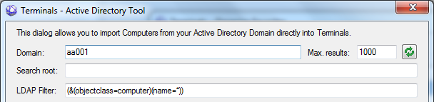

# How to organize favorites
Some of you are connecting to many computers. Searching for required favorite than doesn't have to be easy. In main window, Favorites pane shows only connection name and you are able only create new connection or edit existing. To provide more comfortable favorites management go to "Favorites" > "Organize favorites".  In this dialog you see more information at once and additionally you can Delete, Copy, Rename or import existing connections.

## Manage Groups (Tags) 
When managing discussions on the internet we are used to organize our topics using labels called Tags. In Terminals this labels are also called Tags and are used in similar meaning. There is no extra tool, where you organize Tags for all connections. Simply open one selected connection settings and switch to "Groups" page. Here you will see three boxes:
* "New Group": If you need create new Groups, type its name here and click on green button close to it. New Tag will be listed in available 
* "Connection Group": Here are listed all Groups associated to this connection. Button on right side removes selected Tag from this list. To add new Tags use text box above or select existing one from text box bellow.
* "All available Group": Lists all Tags defined on all connections. If you want to show more connections under the same Tag, select one from this list and click green button on right side or double click on it.

## Import favorites
When reinstalling or moving from one computer to another or moving from another tool (;-)) you will probably need to backup, restore, import and export favorites. You can do this from main window "File" menu or from "Organize favorites".
Supported file formats are:

||Application||File extension||Import||Export||
|Terminals|XML|X|X|
|Microsoft remote desktop|RDP|X|X|
|Multiple remote desktops manager|MRC|X|-|
|Visionapp remote desktop|VRB|X|-|
|Microsoft remote desktop connection manager|RDG|X|-|

Immediately after first time Terminals starts, you will be prompted, if you want to import RDP connections from Windows registry.
There are stored recently used Microsoft remote desktop connections, so don't have to import them manually.

To export favorites you have to select, which favorites you want to export. By default passwords aren't exported.  Because of internal algorithms, the only supported format from where you can import passwords is Terminals file. Please note that if you select "Export passwords", passwords will be exported in human readable form into the target file!
When importing connections, you can choose, if you want to overwrite existing connections with the same name. Therefore we recommend to back up your connections before you import from unknown file.

## Favorites tree
All operations to create connection favorites can be done in Favorites tree. The tree allows all operations you usually in Windows Explorer (add group, delete favorite etc.). You can also use drag and drop. Here are tips how to use it:

* You can also import connections using drag and drop of files into favorites tree
* Hold "Control" key during drag drop to Copy dragged favorite
* Hold "Shift" key during drag drop to Add favorite to target group

## Search for computers servicing remote control protocol
In large networks or if you don't know server name, it is comfortable to search for computers in the network automatically. In terminals you have extra options to do so, not only to import connections from a file. All choices are available in "Organize Favorites" dialog mentioned in previous chapter.

* Scan Active Directory: If your computer is member of Microsoft Active Directory, you can search the active directory for computer entries. Later you can select computers in results list and create favorites for them.
* Scan Network using port scanner: This feature offers you to scan all IP addresses in required range for known services. By default your IP address range is selected and all services used by Terminals are searched. 
* Direct connect to other Terminals

Active directory scan:

**Domain**: Domain name to search in. Doesn't have to be fully qualified domain name. Default domain defined Terminals Options is used as default value.
**Max. results**: Maximum results to obtain. Number in range 0-5000, default 1000. Used to reduce number of obtained results.
**Search root**: In case of large domain you can define start point of the search. Usually AD organization unit. For the ou 'servers' under the root of the domain 'mydomain.local', you have to fill in ou=servers,dc=mydomain,dc=local' to start searching from there. Leave empty to search in whole domain (default).
**LDAP filter**: LDAP search filter to use. Use default value to obtain all computers only. For more details how to filter see [http://social.technet.microsoft.com/wiki/contents/articles/5392.active-directory-ldap-syntax-filters.aspx](http://social.technet.microsoft.com/wiki/contents/articles/5392.active-directory-ldap-syntax-filters.aspx)
**Refresh** button: Set search criteria (domain, search root, filter and max. results) to default values.

Note: Some properties are available since version 3.0.

On second page "Direct connection" in "Scan Network" dialog you can establish a direct connection with another machine on the network in order to share connections. In this case the server application and the client application is Terminals running on both sides. Follow the steps described in this dialog.

## Grouping connections
Some people are working simultaneously on more than one remote computer. In this case you will need to group favorites and start all connections in one group at once. First you have to create groups. You can do so by selecting "Create group from active connections" from "Groups menu". This command opens dialog, where you type group name and all active connections will be added to the newly created group. Or you can select "Add current connection to" command, if you want to add the active connection to already created group. To use more custom groups management, open "Organize groups" from the same menu. The opened dialog will present two tables. In the left side you define groups and on the right side you select connections associated with selected group. Each table has its own two buttons to Add/Remove items.