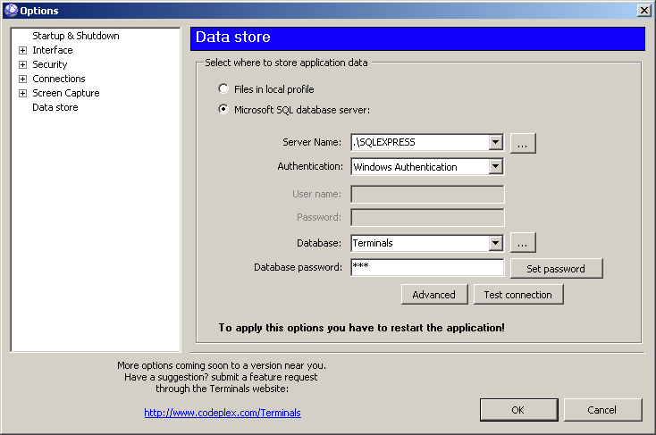

# How to store data in SQL database

Note: This feature is under active development and isn't present in any of published versions.

Terminals supports two possibilities how to store user data. If you don't change any application options the data are saved into local xml based files (for more details see [Backup and restore settings files](Backup-and-restore-settings-files.md)). Because the  possibilities of sharing files are limited, we implemented the same functionality using SQL database. Currently **only Microsoft SQL server** is supported, tested on version 2008 Express.

## How to create database
To create a terminals database use sql script stored under "Main\Resources\Database" or you can copy empty database stored also there. The database is used only as a simple store. Currently (version 3.0) it contains only a few tables, stored procedures and relations. There is no extra logic like triggers, indexes or in database stored CLR code etc.
Because the usage of data from performance point of view is not well known, there are no special indexes or other optimization. Any performance optimization proposals from database administrators are welcome.
The empty database in this case doesn't mean empty database, it means database filled with required model structure (tables, relations and stored procedures), but without any value in all tables.

## How to configure the connection
To distribute the database connection in your environment, start Terminals on one of your machines, go to application options and under "**Data Store**" you will find relevant options. To successfully connect to the database, configure:

* **Connection string**: Usual connection string used to connect to the MS SQL database. When the SQL storage is enabled, default connection string is offered as an example. For more details consult the MS SQL documentation.

* **Database password**: Because we have to protect the shared content stored in the database, SQL database is simply protected by this password. The password is checked when Terminals starts. Note, that this is not the application master password, nor the connection string password. Default database password is empty.

Both values are stored as a part of application configuration and is stored like other parts in encrypted form. The "**Test connection**" button allows you check, if application is able to connect to the database. It doesn't check the database structure. Anyway, if the database isn't available during application startup, the data store will be switched back to file persisted.

Following image describes the configuration in more detail:

* **Server Name** "..." button: Use Sql browser service to locate SQL instances in your network
* **Database** "..." button: Locate all available databases attached to the selected database server instance
* **Database password**: Provide current Terminals database master password set up by your application administrator. This is used to validate, when connecting to the database.
* **Set password**: Configure the database with new database password. You will be prompted to provide old and new password like in other password resets. If old password doesn't match, you will be not able to apply new password. Depending on content of your database this procedure can take a while, because it requires to update all already stored passwords.
* **Test connection**: Creates new connection string from currently configured values and tries to connect to terminals database. Result is shown, when procedure finishes. Not only connection string is checked, but also provided database master password is checked. Using this button you are able to check complete connection setup.
* **Advanced**: If you need to provide more detail about your connection, like timeouts etc. this button shows detail properties dialog, where you are able to configure complete MS SQL connection string.

## SQL store behavior
* Only simple concurrent updates are implemented. E.g. In some cases the database request may fail. In this case restart the application
* Simple refresh is done each 30 seconds. So wait few seconds after your colleague saves favorite changes
* There are no private favorites or credentials. All team members share complete database content
* The database is shared for all users, there is no possibility to isolate favorites for each user. There is no user or groups management.
* Database Master password updates are done in transaction. It should be secure to update all your stored passwords, if you already have them stored by clients.
* If you forget database master password, go to the options table and clear "MasterPasswordHash" row value. In this case, there is no restore. All your passwords protected by this database master password are lost.

## How to migrate the data from files to the database
* To switch between data store types you have to restart the application
* Changing the data store doesn't copy, change or remove any data
* If you use both data stored, their data are isolated, but they share application configuration
* There is no possibility to combine favorites between file store and database store
* To migrate the content you have to export favorites, restart the application and import the exported content
